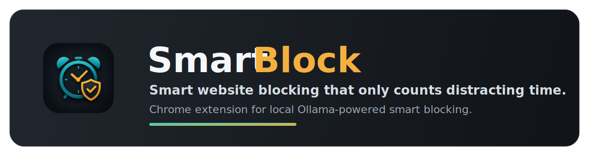

[](https://github.com/pshkrh/smartblock/releases)
[](https://github.com/pshkrh/smartblock/blob/main/LICENSE)


SmartBlock is a Chrome/Brave extension for time blocking mixed-use websites with a local Ollama model. Instead of treating an entire domain as distracting, it classifies the specific page you are on and only counts pages that look like entertainment.

| Mode | Behavior |
| --- | --- |
| `Smart` | Classifies the page and only counts distracting time |
| `Strict` | Counts all active time on the domain |

## What It Does

- Tracks configured domains in `Smart` or `Strict` mode.
- Uses a local Ollama model for page classification.
- Uses manual overrides and cache before making a fresh model call.
- Redirects over-limit domains to a block page.
- Shows an Activity view with counted vs ignored pages, source labels, overrides, and cache clearing.

## Current Behavior

- SmartBlock only tracks domains you explicitly add in the popup.
- SmartBlock can count tracked tabs across multiple Brave/Chrome windows at the same time.
- SmartBlock tracks one active tab per browser window. Background tabs in the same window do not count.
- Two active tracked domains in two windows can count at the same time.
- Multiple active pages on the same domain count against that domain only once, so two `youtube.com` windows do not spend the limit twice as fast.
- In Smart mode, video pages only count while the active video is playing. Strict mode counts active time regardless of video state.
- Ollama status in the popup is tied to the selected model:
  - `?` no model selected yet
  - `✓` available in Ollama
  - `!` selected model not installed
  - `×` Ollama offline

## How Classification Works

For `Smart` domains, SmartBlock evaluates a page in this order:

1. Manual override from the Activity tab
2. Cached classification
3. Ollama classification
4. Fail-open fallback to productive if Ollama is unavailable or no model is selected

Smart mode is model-driven for tracked domains. The built-in rule layer only keeps untracked domains out of Ollama; it does not hardcode sites as productive or distracting.

SmartBlock sends Ollama the current page URL, page title, and a compact content snippet. The snippet is built from high-signal page text such as Open Graph/Twitter title and description metadata, meta descriptions, `h1`/main headings, and visible text from the main page area. It intentionally does not send the whole page, because full-page dumps are slower, noisier, and often include navigation, comments, recommendations, and other boilerplate.

## Install

### 1. Clone the repository

```bash
git clone https://github.com/pshkrh/smartblock.git
cd smartblock
```

### 2. Install Ollama and at least one model

```bash
brew install ollama
ollama pull qwen2.5:7b
```

You can pick the active model from the popup header after Ollama is running.

### 3. Start Ollama with extension access enabled

```bash
OLLAMA_ORIGINS="chrome-extension://*" ollama serve
```

If you prefer the macOS app, set the environment first and then launch it:

```bash
launchctl setenv OLLAMA_ORIGINS "chrome-extension://*"
open -a Ollama
```

### 4. Load the extension in Chrome or Brave

1. Open `chrome://extensions` or `brave://extensions`
2. Enable `Developer mode`
3. Click `Load unpacked`
4. Select `/path/to/smartblock/extension`
5. Pin SmartBlock to the toolbar

### 5. Choose a model and add your first site

1. Open the SmartBlock popup
2. Pick an Ollama model from the `Model` dropdown in the header
3. Add a domain such as `youtube.com`
4. Choose `Smart` or `Strict`
5. Set a daily limit in minutes

## Using It

1. Open the popup
2. Add a domain such as `youtube.com`
3. Choose `Smart` or `Strict`
4. Set a daily limit in minutes

In the Activity tab, you can inspect what counted, what did not, and override bad model decisions.

Use `Smart` when only some pages on a site should count. Use `Strict` when every active page on that domain should count.

## Popup Overview

- `Limits` tab:
  - add/remove tracked domains
  - edit mode and daily limit
  - see live usage progress
- `Activity` tab:
  - recent classified pages
  - counted vs ignored summaries
  - manual `Count` / `Ignore` actions
  - clear cached classifications

## Block Behavior

When a domain hits its limit, SmartBlock redirects the tab to a block page. To continue, raise the domain limit from the popup. Removing the domain clears today's stored usage and activity for that site.

## GitHub Releases

Releases are built by GitHub Actions when a version tag is pushed. The workflow validates the extension JavaScript, checks the manifest, verifies icon dimensions, zips the `extension/` directory, and attaches the zip to a GitHub Release.

```bash
git tag v0.1.0
git push origin v0.1.0
```

The uploaded zip can be installed by downloading it, extracting it, and loading the extracted extension folder from `chrome://extensions` or `brave://extensions`.

## Repository Layout

```text
extension/
├── manifest.json
├── icons/
└── src/
    ├── background/
    │   ├── service-worker.js
    │   ├── timer.js
    │   ├── classifier.js
    │   ├── rules.js
    │   ├── blocker.js
    │   ├── storage.js
    │   └── alarms.js
    ├── shared/
    ├── content/
    ├── popup/
    └── block/
```

## Customizing Behavior

Use `Strict` mode when you want a site to count deterministically.

Use `Smart` mode when you want SmartBlock to classify each page with Ollama and only count distracting content.

Pick the Ollama model from the popup header. SmartBlock does not ship with a default model because local model availability varies by user and machine.

## Troubleshooting

**Popup says `Ollama offline`**

Make sure Ollama is running and started with `OLLAMA_ORIGINS="chrome-extension://*"`.

**Popup shows `?`**

Pick a model from the `Model` dropdown in the popup header.

**Popup shows `!` for the selected model**

Install the model you want to use, then refresh the popup:

```bash
ollama pull qwen2.5:7b
```

**A page is classified incorrectly**

Use the Activity tab to mark it as `Count` or `Ignore`. Manual overrides win over cache and model output.

**Deleting and re-adding a site still shows old usage**

Removing a domain clears today's stored usage and activity for that site. Reload the popup if it was open while you made the change.
